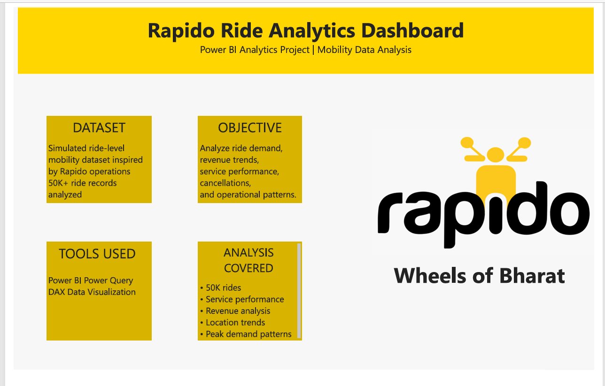
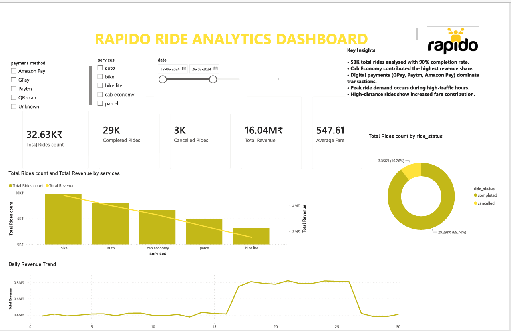
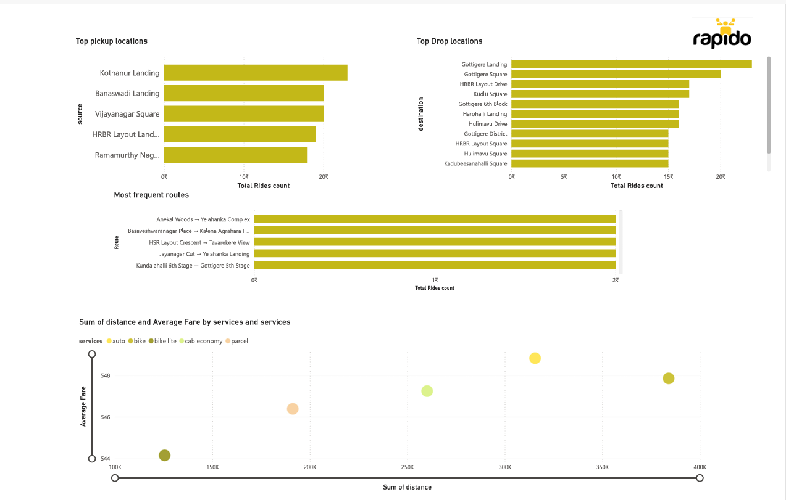
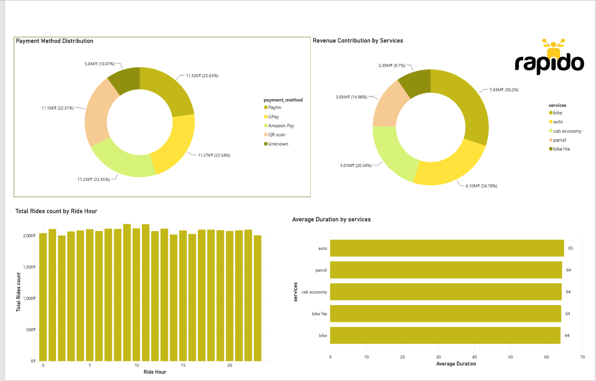

# 🚴 Rapido Ride Analytics Dashboard | Power BI

An interactive **Power BI dashboard** built to analyze simulated ride-level mobility data and uncover insights related to **ride demand, revenue performance, service efficiency, payment behavior, and operational trends**.

This project demonstrates the transformation of raw ride data into meaningful business insights using **Power BI, DAX, Power Query, and data visualization techniques**.

---

# 📌 Project Overview

## Objective

The objective of this project is to analyze ride-hailing operations and answer key business questions:

- Which services generate the highest revenue?
- What are the peak ride demand hours?
- Which locations contribute the highest ride activity?
- How does distance impact fare?
- What operational improvements can be identified?

---

# 📊 Dashboard Preview

## 1. Project Overview

This page provides project context:

- Dataset description
- Business objectives
- Tools used
- Analysis scope

---

# 2. Executive Overview

This dashboard provides a high-level business view:

### KPIs:
- Total Ride Count
- Completed Rides
- Cancelled Rides
- Total Revenue
- Average Fare

### Analysis:
- Service-wise ride and revenue performance
- Ride completion analysis
- Revenue trends

---

# 3. Location Analytics

This page analyzes geographical ride patterns:

### Insights:
- Top pickup locations
- Top destination locations
- Popular routes
- Distance vs fare relationship

---

# 4. Operations Analytics

This page focuses on operational performance:

### Analysis:
- Payment method distribution
- Peak hour demand analysis
- Revenue contribution by service
- Average trip duration

---

# 🛠️ Tools Used

- Power BI
- DAX
- Power Query
- Data Visualization
- Excel / CSV Data Processing

---

# 📂 Dataset

The dataset contains simulated ride-level mobility data with:

- Service type
- Ride date and time
- Source and destination
- Ride status
- Distance travelled
- Ride charges
- Payment methods

**Disclaimer:**  
This project uses a simulated ride dataset inspired by urban mobility operations. It does not represent Rapido's internal company data.

---

# 🔍 Key Insights

- Analyzed **50K+ rides** to understand ride patterns and operational performance.
- Identified service categories contributing the highest revenue.
- Studied peak demand periods to support better driver allocation.
- Evaluated cancellation trends for operational improvement.
- Analyzed payment preferences and digital payment adoption.
- Explored relationship between trip distance and fare.

---

# 💡 Business Recommendations

- Increase driver availability during peak demand hours.
- Investigate cancellation hotspots by service and time period.
- Optimize pricing strategies for longer-distance rides.
- Improve utilization of lower-performing services through targeted incentives.

---

# 📁 Repository Contents
